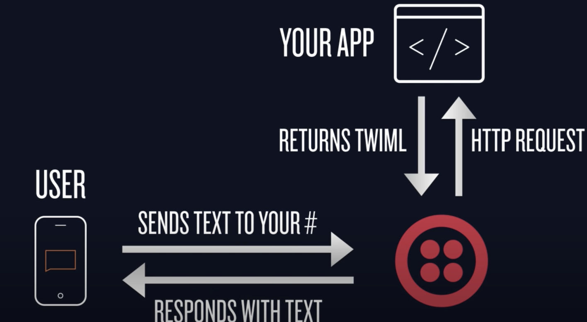

# teamjipyeong
## Inbound Message Aggregator Service


## Prerequisites
- Install ngrok (https://ngrok.com/download)
- Register and login to Twilio account (https://www.twilio.com)
- Register and login to Wifitext account (https://wifitext.com)
- NodeJS

## Stack Used
- NodeJS
- Typescript
- Ruby
- Vendor: Twilio & wifitext

## Gateway Flow


## Caveats
Apparently Twilio only support US based number for now, indonesia region is not yet supported. The solution is you need to buy a private US number via https://wifitext.com for $2.99

*If you want to access Twilio and wifitext account, please contact: alchristleo for help

## How To Start

#### Starting nodejs service
```npm install```

```npm run startWorker```

#### Install twilio cli globally
```npm install -g twilio-cli```

After installation done, run:

```twilio login```

You'll be asked about SID, Secret, and app name, which you can get from twilio dashboard after login: https://www.twilio.com/console

Configure your webhook url

```twilio phone-numbers:update "[GATEWAY_PHONE_NUMBER]" --sms-url=http://localhost:4567/sms```

